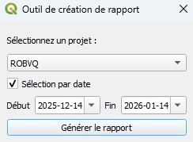
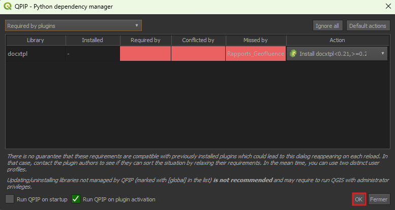

# Rapports Géofluence

Cette extension QGIS permet de générer des rapports aux formats word depuis les formulaires de Géofluence.

## Fonctionnement

1. Sélectionner un rapport depuis le menu des extensions. Chaque rapport est associé à un formulaire spécifique. Le formulaire doit être dans le projet actif pour produire un rapport.

2. Choisir un projet (table événement) ou une période (date de début et de fin) pour sélectionner les entités à inclure dans le rapport. La table événement doit être dans le projet actif.

## Installation des dépendances

L'extension nécessite l'installation de dépendances. 

1. Installer l'extension qpip : https://plugins.qgis.org/plugins/a00_qpip/#plugin-details (accessible depuis de gestionnaire des extensions de qgis).
    
    - qpip est un outil qui permet de gérer simplement les dépendances python dans qgis.

2. Activer l'extension Rapports Géofluence. Au moment de l'activation une fenêtre qpip s'ouvre et identifie les dépendances à installer. Cliquer sur ok pour lancer l'installation.

4. Il est possible que vous ayez à activer le plugin à nouveau pour le voir apparaitre dans le menu des extensions (simplement à cocher l'extension dans le gestionnaire).

## Pour les photos

Pour que les photos prises à partir des formulaires apparaissent dans les rapports, un dossier DCIM doit exister au même endroit que le projet QGIS actif.

Placer vos fichiers photos dans ce dossier en vous assurant que les noms des fichiers correspondent à ceux qu'on retrouve dans le formulaire. Si vous n'avez pas modifié les noms des fichiers après la collecte des données, vous ne devriez pas rencontrer de problème.